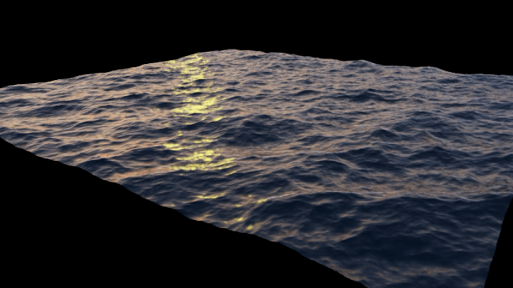

# Ocean Deformer

### Compute graph node animating mesh vertices according to deep water waves.  Written in WARP language for high performance.    

How to use this compute node in Create:

1. Make sure to enable this node extension in the extension manager (along with the WARP extension).
2. Add a mesh you would like to get deformed.
3. Duplicate that mesh (right click -> duplicate).
4. In the compute graph editor:
   - Create nodes for both meshes (original and duplicate)
   - Create "read prim" node and set target to original mesh
   - Create "write prim" node and set target to  duplicated mesh
   - Create "read time" node
   - Create "Ocean deformer" node for this extension 
   - Connect the nodes as follows:
     - "points" output of "read prim" node to "input points" of ocean deformer
     - "output points" of ocean deformer to points of "write prim" node  
     - "Animation time (seconds)" of "Read time" node to "animation time" of "ocean deformer" node
5. Hit play.
6. Parameters and common values explained
   - Smallest/Largest wavelengths (1 m to 500 m wavelengths for full ocean) 
   - Windspeed: U_10 windspeed (0..32 m/s) 
   - Water depth: determines the amplitude of the largest waves (20 m)
   - Directionality: dimensionless, adjust to taste (5.0)
   - Direction: Angle of directional waves, adjust to taste 
   - Wave amplitude: Factor for wave amplitudes (1.0)
   - Wave scale: Horizontal scaling of the waves (1.0)

This video is showing the steps above:
https://drive.google.com/file/d/1aAmSFMDbsomN-x3NHu0k3U3AG4wxLPIl

A working oceanExample.usd file can be found in the "data" subfolder.

